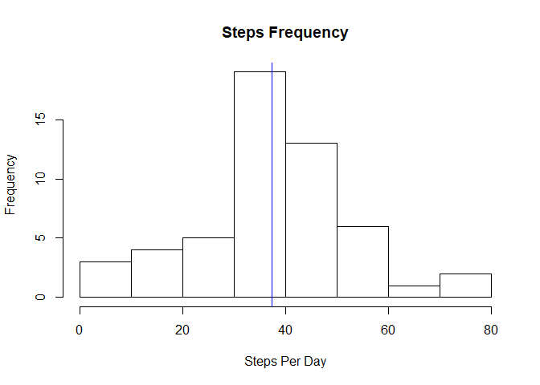
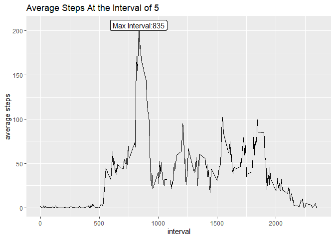
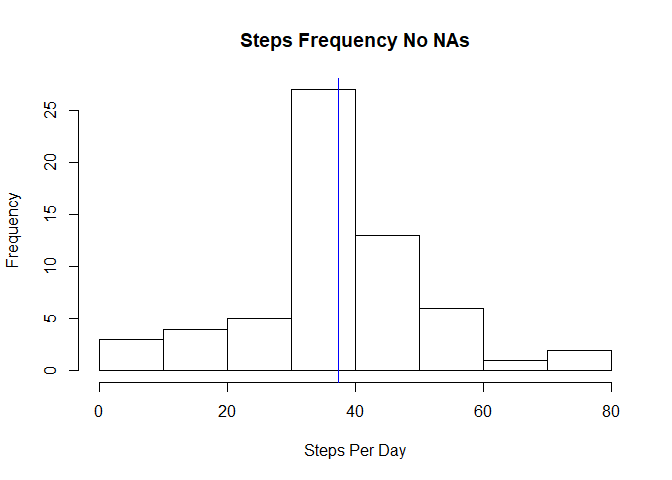
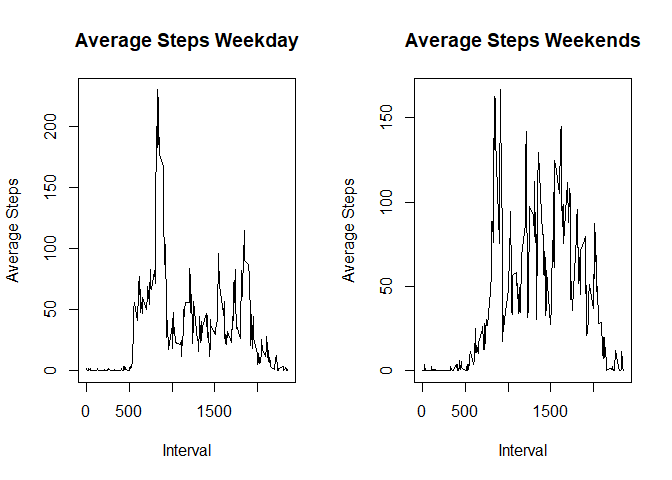

## Loading and preprocessing the data


```r
rm(list=ls())
getwd()
```

```
## [1] "C:/Users/Sczon/OneDrive/Documents/UNIVERISTY/JH_data_science/RepResearch_1/RepData_PeerAssessment1-master/RepData_PeerAssessment1"
```

```r
#setwd(dirname(rstudioapi::getActiveDocumentContext()$path))
library(dplyr)
library(lubridate)
library(ggplot2)
library(formattable)
#####Loading the data#####
fileURL<-"https://d396qusza40orc.cloudfront.net/repdata%2Fdata%2Factivity.zip"
download.file(fileURL, destfile = "./dt.zip", method = "curl")
#List all files and paths
files<-as.character(unzip("./dt.zip", list = TRUE)$Name) 
files
```

```
## [1] "activity.csv"
```

```r
#[1] "activity.csv"           
#Saving the dataset
data_orig <- read.csv(unzip("./dt.zip", files = files[1]))
```

## What is mean total number of steps taken per day?
Mean and average steps per day

```r
per_day<-data_orig%>%group_by(date)%>%summarize(per_day=mean(steps))
avg_steps<-mean(per_day$per_day, na.rm = TRUE)
median_steps<-median(per_day$per_day, na.rm = TRUE)
```

```r
avg_steps
```

```
## [1] 37.3826
```

```r
median_steps
```

```
## [1] 37.37847
```
Building steps frequency histogram

```r
hist(per_day$per_day, xlab= "Steps Per Day", main = 'Steps Frequency')
abline(v=avg_steps, col = "blue")
```

<!-- -->


## What is the average daily activity pattern?

```r
avg_steps<-data_orig%>%group_by(interval)%>%summarize(avg_steps=mean(steps, na.rm=TRUE))

  ggplot(avg_steps, aes(interval, avg_steps), ylab='average steps') + geom_line() +
    geom_label(data=avg_steps[avg_steps$avg_steps==max(avg_steps$avg_steps),], 
               aes(label = paste0('Max Interval:', round(interval,2)))) +
    labs( y = 'average steps', 
         title = 'Average Steps At the Interval of 5')
```

<!-- -->


## Imputing missing values
Scanning for missing values

```r
count(data_orig[is.na(data_orig$steps),])
```

```
## # A tibble: 1 x 1
##       n
##   <int>
## 1  2304
```

```r
count(data_orig[is.na(data_orig$interval),])
```

```
## # A tibble: 1 x 1
##       n
##   <int>
## 1     0
```

```r
count(data_orig[is.na(data_orig$date),])
```

```
## # A tibble: 1 x 1
##       n
##   <int>
## 1     0
```


```r
avg_steps<-data_orig%>%group_by(interval)%>%summarize(avg_steps=mean(steps, na.rm=TRUE))
data_no_na<-merge(data_orig,avg_steps, by='interval')
data_no_na$steps_no_na<-round(ifelse(is.na(data_no_na$steps),  data_no_na$avg_steps, data_no_na$steps))
data_no_na<-data_no_na[,c('interval','date','steps_no_na')]
```

Steps frequency without missing values


```r
per_day_nna<-data_no_na%>%group_by(date)%>%summarize(per_day=mean(steps_no_na))
hist(per_day_nna$per_day, xlab= "Steps Per Day", main = 'Steps Frequency No NAs')
abline(v=mean(per_day_nna$per_day), col = "blue")
```

<!-- -->

Mean and median steps per day (without missing values)


```r
avg_steps_nna<-round(mean(per_day_nna$per_day, na.rm = TRUE),4)
median_steps_nna<-round(median(per_day_nna$per_day, na.rm = TRUE),4)
avg_steps<-round(mean(per_day$per_day, na.rm = TRUE),4)
median_steps<-round(median(per_day$per_day, na.rm = TRUE),4)
```

```r
avg_steps_nna #average no NAs
```

```
## [1] 37.3807
```

```r
median_steps_nna #median no NAs
```

```
## [1] 37.3681
```
Mean and median steps per day comparison (with/without missing values)

```r
avg_steps<-round(mean(per_day$per_day, na.rm = TRUE),4)
median_steps<-round(median(per_day$per_day, na.rm = TRUE),4)

table_dif<-as.data.frame(rbind(cbind(avg_steps,median_steps, 'NA'), 
  (cbind(avg_steps_nna, median_steps_nna, 'No-NA'))))
names(table_dif)[3]<-"NA_Indicator"
```


```r
formattable(table_dif)
```


<table class="table table-condensed">
 <thead>
  <tr>
   <th style="text-align:right;"> avg_steps </th>
   <th style="text-align:right;"> median_steps </th>
   <th style="text-align:right;"> NA_Indicator </th>
  </tr>
 </thead>
<tbody>
  <tr>
   <td style="text-align:right;"> 37.3826 </td>
   <td style="text-align:right;"> 37.3785 </td>
   <td style="text-align:right;"> NA </td>
  </tr>
  <tr>
   <td style="text-align:right;"> 37.3807 </td>
   <td style="text-align:right;"> 37.3681 </td>
   <td style="text-align:right;"> No-NA </td>
  </tr>
</tbody>
</table>


## Are there differences in activity patterns between weekdays and weekends?
Building the datasets

```r
data_no_na$day_ind<-ifelse(weekdays(as.Date(data_no_na$date)) %in% c("Saturday","Sunday"),
                           'Weekend', 'Weekday' )
avg_steps_week<-data_no_na%>%filter(day_ind=='Weekday')%>%group_by(interval)%>%
  summarize(avg_steps=mean(steps_no_na))
avg_steps_weekend<-data_no_na%>%filter(day_ind=='Weekend')%>%group_by(interval)%>%
  summarize(avg_steps=mean(steps_no_na))
```

Building the panel chart


```r
par(mfrow=c(1,2))
plot(avg_steps_week$interval, avg_steps_week$avg_steps , type = "l", 
     main = 'Average Steps Weekday', ylab='Average Steps', xlab='Interval') 
plot(avg_steps_weekend$interval, avg_steps_weekend$avg_steps , type = "l", 
     main = 'Average Steps Weekends', ylab='Average Steps', xlab='Interval') 
```

<!-- -->
